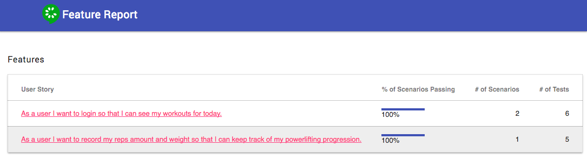
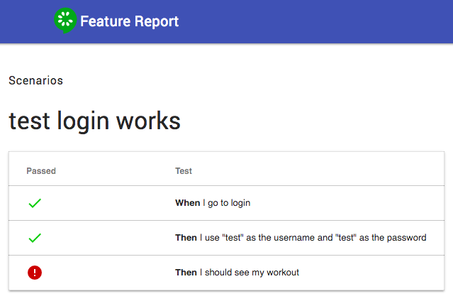

# cucumber-protractor-report
Shows report of which features pass or fail as well as which scenario statements pass or fail from running Angular's Protractor via Cucumber.

## Previews

List all features with percentage of scenarios that pass.

For each feature, showcases which steps pass / do not pass.

## Installation

`npm install cucumber-protractor-report`